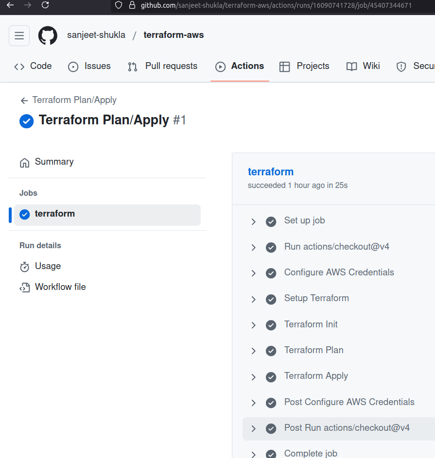

### 1. Using OIDC Role
- GHA Run [Link](https://github.com/sanjeet-shukla/terraform-aws/actions/runs/16091204110/job/45408329706)
- Documentation can be found [here](https://docs.github.com/en/actions/how-tos/security-for-github-actions/security-hardening-your-deployments/configuring-openid-connect-in-amazon-web-services)

> 

### 2. Using secrets
- GHA Run [Link](https://github.com/sanjeet-shukla/terraform-aws/actions/runs/16090741728/job/45407344671)
> 
