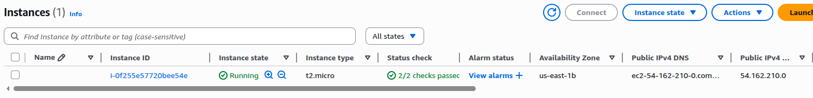

# Terraform a Day 


The sequence for a terraform command is:
- terraform init     # Initialize Terraform and download AWS provider
- terraform plan     # Preview changes
- terraform apply    # Deploy the EC2 instance
- terraform destroy  # Clean up (deletes all resources)


main.tf

```terraform

terraform {
  required_providers {
    aws = {
      source = "hashicorp/aws"
      version = "~>3.0"
    }
  }
}

# Configure AWS provider (replace with your preferred region)
provider "aws" {
  region = "us-east-1"
}


# Create a security group allowing SSH (port 22)
resource "aws_security_group" "allow_ssh" {
  name        = "allow_ssh"
  description = "Allow SSH inbound traffic"

  ingress {
    from_port   = 22
    to_port     = 22
    protocol    = "tcp"
    cidr_blocks = ["0.0.0.0/0"] # Warning: Restrict this in production!
  }

  egress {
    from_port   = 0
    to_port     = 0
    protocol    = "-1"
    cidr_blocks = ["0.0.0.0/0"]
  }
}

resource "aws_instance" "example" {
  ami           = "ami-0c55b159cbfafe1f0" # Ubuntu 20.04 LTS (us-east-1)
  instance_type = "t2.micro"
#  key_name      = "your-key-pair-name"     # Replace with your SSH key pair

#  vpc_security_group_ids = [aws_security_group.allow_ssh.id]

  tags = {
    Name = "terraform-boilerplate"
  }
}


# Output the public IP of the instance
output "public_ip" {
  value = aws_instance.example.public_ip
}
```

Prerequisites:
- Install Terraform.
- Configure AWS credentials (via aws configure or environment variables).

Commands:
```shell
terraform init     # Initialize Terraform and download AWS provider
terraform plan     # Preview changes
terraform apply    # Deploy the EC2 instance
terraform destroy  # Clean up (deletes all resources)
```


**Key Components**
* Resource	Purpose
* aws_security_group	Defines firewall rules for the EC2 instance.
* aws_instance	Creates the virtual machine.
* output	Displays the instance’s public IP after deployment.


To check the resources which are allowed you should check terraform documentation
For example here is documentation for aws instances:
https://registry.terraform.io/providers/hashicorp/aws/2.70.1/docs/resources/instance

### Let's run terraform init
> 


### Let's run terraform plan command to review changes
> 


Since plan looks good, so let's go ahead with terraform apply command
> 
> 

Now we can go to aws and see that our resource has been created. 
> 


### Terraform apply asks for yes to proceed, how to deal with this in github actions or automation scripts.
```shell
terraform apply -auto-approve

# Or in github actions
- name: Terraform Apply
  run: terraform apply -auto-approve
  
# Or using environment variable
export TF_INPUT=0
terraform apply
```

### Let's run terraform destroy command to tear it down

> 
> 


Terraform providers
https://registry.terraform.io/browse/providers


### How to setup credentials in github to run terraform through github actions?


### How to setup an s3 bucket and DynamoDB for terraform state file?


### Running Terraform from a directory
- `terraform -chdir=./db init`
- `terraform -chdir=./db plan`
- `terraform -chdir=./db apply`

### can we run a file which is not named as main.tf?


https://www.youtube.com/watch?v=7xngnjfIlK4&t=56s
https://github.com/sidpalas/devops-directive-terraform-course/tree/main/08-testing/deployed/production
